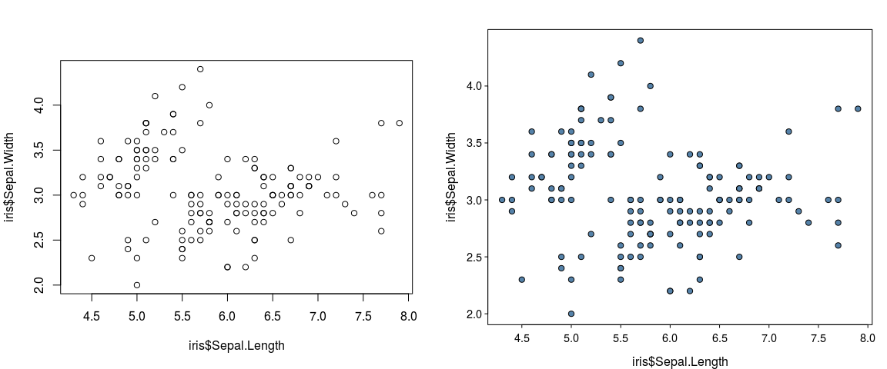
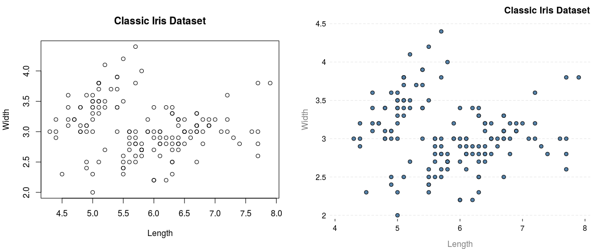
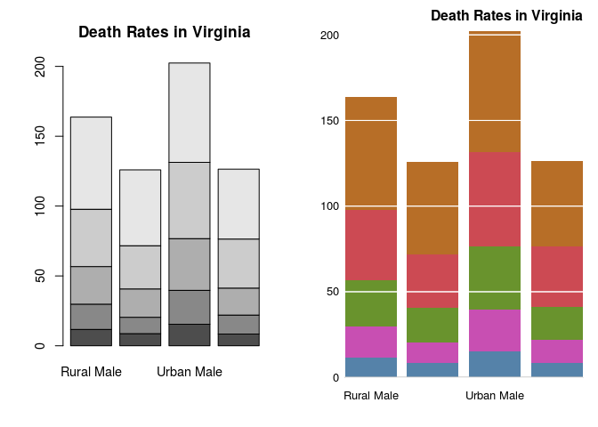

<!-- README.md is generated from README.Rmd. Please edit that file -->
Prettified Base Graphics
------------------------

Load the package and get

``` r
## Masks a lot of base functions
library("prettyB")
```

Compare

``` r
par(mfrow=c(1, 2))
graphics::plot.default(iris$Sepal.Length, iris$Sepal.Width)
plot(iris$Sepal.Length, iris$Sepal.Width)
```


Also have different themes:

``` r
theme_set("minimal")
plot(iris$Sepal.Length, iris$Sepal.Width, main="Classic Iris Dataset", 
     xlab="Length", ylab="Width")
```



Other plots
-----------

The package also prettifies

-   barplots

    ``` r
    barplot(table(iris$Species))
    ```

    
-   qqplots

    ``` r
    qqnorm(rnorm(10))
    ```

    

TODO
----

-   Think a bit more about palettes
-   Boxplots
-   Histograms
    -   Change default colour
    -   Change default method to Scott
-   Bug fix: When the package builds, Rplots.pdf is generated!
