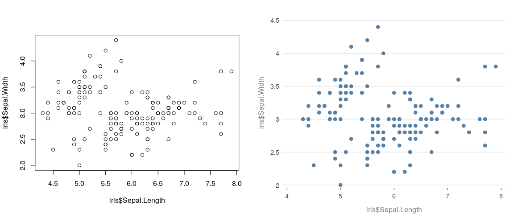
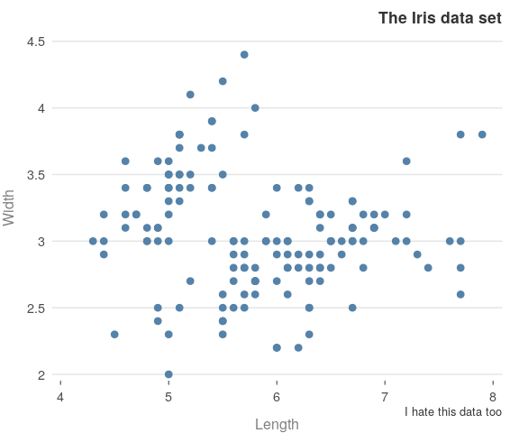
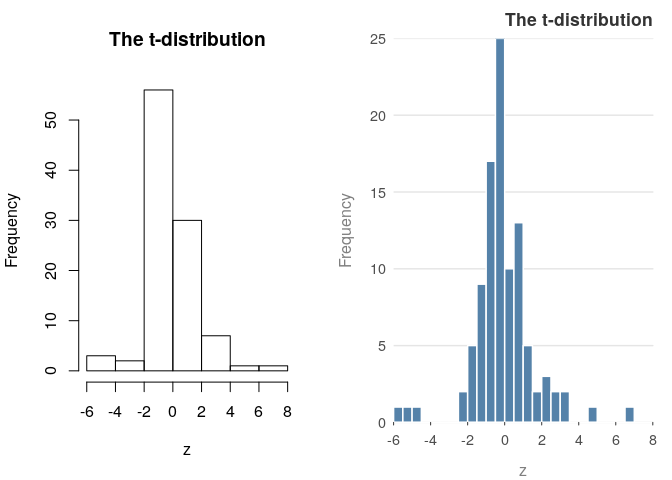
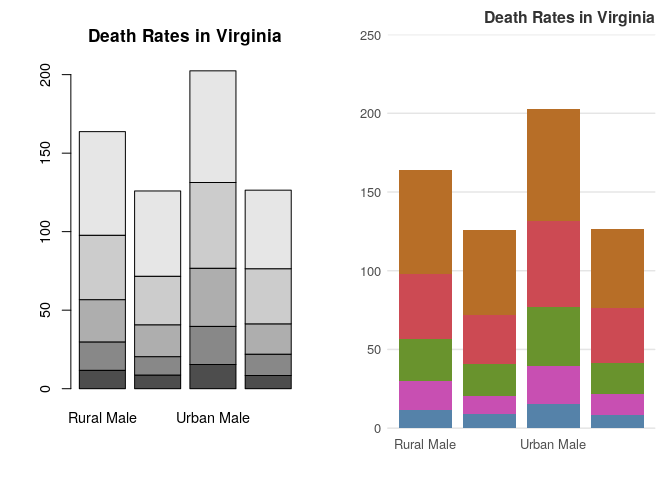

<!-- README.md is generated from README.Rmd. Please edit that file -->

## Prettified Base Graphics

[](https://github.com/jumpingrivers/prettyB/actions)
[](https://cran.r-project.org/package=prettyB)
[](https://lifecycle.r-lib.org/articles/stages.html)
[](https://codecov.io/github/jumpingrivers/prettyB?branch=master)
[](https://cran.r-project.org/package=prettyB)

Anyone who uses R Base graphics, have a 100 and 1 tweaks that they use
to make the figures more presentable. This package aims to capture the
tweaks in one place.

## Installation

The package is still being developed and the graphs are subject to
change. The package is on CRAN and can be installed in the usual way

``` r
install.packages("prettyB")
```

To install the dev version, try

``` r
devtools::install_github("jumpingrivers/prettyB")
```

The package can then be loaded in the usual way

``` r
library("prettyB")
```

## Usage

All plotting functions work exactly as before, with the same inputs. The
difference is that the defaults have been changed. For example, compare

``` r
op = par(mfrow = c(1, 2))
plot(iris$Sepal.Length, iris$Sepal.Width)
plot_p(iris$Sepal.Length, iris$Sepal.Width)
#> 
```



When you first call a **prettyB**, it changes the underlying `par()` and
`palette()`. You can reset this via

``` r
prettyB::reset_prettyB()
```

The core idea of **prettyB** is that no new arguments are introducted to
the plot functions. This means, that no changes to existing code are
required

``` r
plot_p(iris$Sepal.Length, iris$Sepal.Width, 
     xlab = "Length", ylab = "Width",
     main = "The Iris data set", 
     sub = "I hate this data too")
#> 
```



## Other plots

The package also prettifies other functions

-   Histograms

    ``` r
    z = rt(100, 4)
    hist(z, main = "The t-distribution")
    hist_p(z, main = "The t-distribution")
    ```

    

-   barplots

    ``` r
    barplot(VADeaths, main = "Death Rates in Virginia")
    barplot_p(VADeaths, main = "Death Rates in Virginia")
    ```

    

## Package Rationale

This package is **not** a replacement for **ggplot2** or other R related
plotting packages. Instead, it has a few simple aims

-   provide package authors a low dependency method of making their
    plots look pretty
-   provide academics with a way of generating nice plots, but not worry
    about future changes in R
-   provide a simple way for improving the look and feel of plots in
    teaching

Since the generated plots by **prettyB** use standard base graphics,
with no new arguments, this makes plots future proof. As a fall-back,
just remove the `_p`.

I picked up the general style a few years ago, but the book
[Fundamentals of Data
Visualization](https://www.amazon.com/Fundamentals-Data-Visualization-Informative-Compelling/dp/1492031089/)
has made it a bit more consist. The author also provided a free
[online](https://serialmentor.com/dataviz/) version.

## Other information

-   If you have any suggestions or find bugs, please use the github
    [issue tracker](https://github.com/jumpingrivers/prettyB/issues)
-   Feel free to submit pull requests

------------------------------------------------------------------------

Development of this package was supported by [Jumping
Rivers](https://www.jumpingrivers.com)
