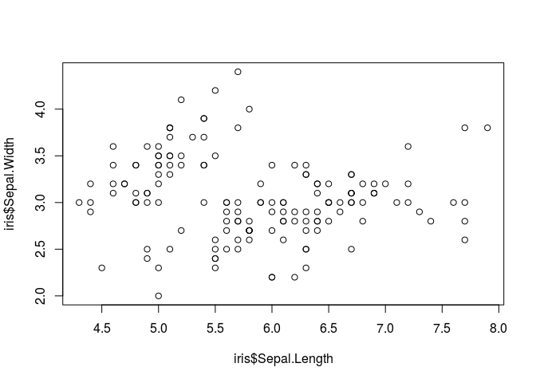
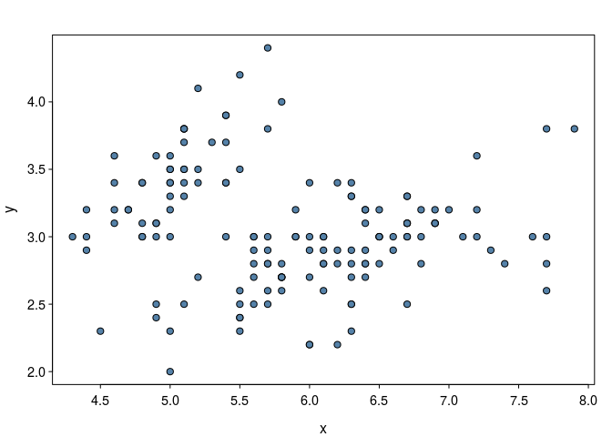
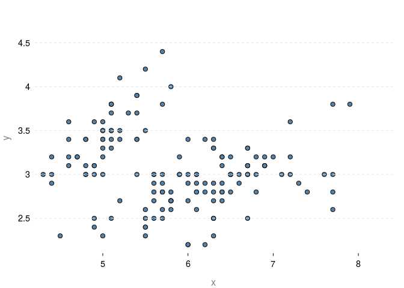

<!-- README.md is generated from README.Rmd. Please edit that file -->
Prettified Base Graphics
------------------------

Still work in progress. Load the package and get

``` r
## Masks a lot of base functions
library(prettyB)
```

Compare

``` r
graphics::plot.default(iris$Sepal.Length, iris$Sepal.Width)
```



``` r
plot(iris$Sepal.Length, iris$Sepal.Width)
```



Also have different themes:

``` r
theme_set("minimal")
plot(iris$Sepal.Length, iris$Sepal.Width)
```



Known issues
------------

-   `qqnorm` doesn't work (see example.R)
-   `par(mfrow=c(1, 2))` no longer works
-   `barplot` probably doesn't work
