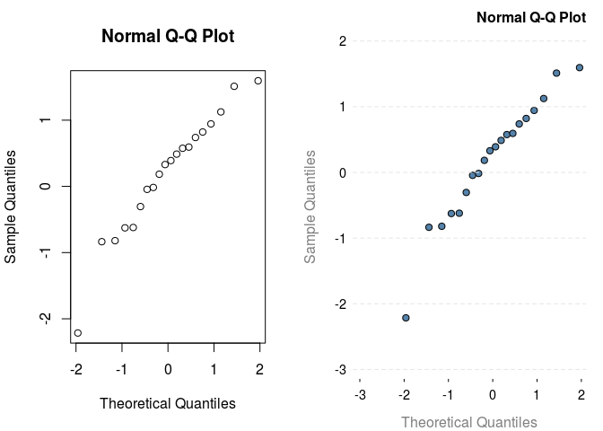
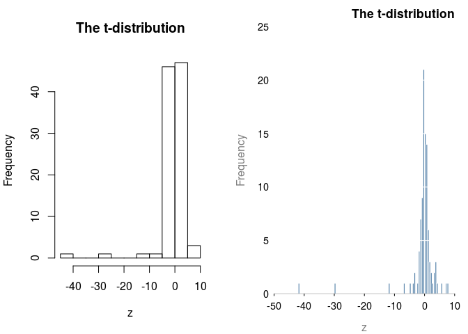

<!-- README.md is generated from README.Rmd. Please edit that file -->
Prettified Base Graphics
------------------------

Anyone who uses R Base graphics, have a 100 and 1 tweaks that they use to make the figures more presentable. This package aims to capture the tweaks in one place. By *masking* standard plotting functions, we can automatically make base graphics a bit more pretty.

Installation
------------

The package is still being developed and the API is subject to change. To install the package from github, use **devtools**

``` r
devtools::install_github("jumpingrivers/prettyB")
```

The package can then be loaded in the usual way

``` r
## Warning: base function masking
library("prettyB")
```

Usage
-----

All plotting functions work exactly as before, with the same inputs. The difference is that the defaults have been changed. For example, compare

``` r
op = par(mfrow = c(1, 2))
graphics::plot.default(iris$Sepal.Length, iris$Sepal.Width)
plot(iris$Sepal.Length, iris$Sepal.Width)
```


The second `plot()` function call is from the **prettyB** package.

There are currently two themes: `expand` (default) and `minimal`:

``` r
theme_set("minimal")
graphics::plot.default(iris$Sepal.Length, iris$Sepal.Width, 
     main="Classic Iris Dataset", xlab="Length", ylab="Width")
plot(iris$Sepal.Length, iris$Sepal.Width, 
     main="Classic Iris Dataset", xlab="Length", ylab="Width")
```


Other plots
-----------

The package also prettifies other functions (examples below use the `minimal` theme).

-   barplots

    ``` r
    graphics::barplot.default(VADeaths, main = "Death Rates in Virginia")
    barplot(VADeaths, main = "Death Rates in Virginia")
    ```

    
-   qqplots

    ``` r
    x = rnorm(20)
    stats:::qqnorm.default(x)
    qqnorm(x)
    ```

    
-   Histograms

    ``` r
    z = rt(100, 2)
    graphics::hist.default(z, main="The t-distribution")
    hist(z, main="The t-distribution")
    ```

    

TODO
----

-   Think a bit more about palettes
-   Vignettes: What defaults have been changed.
-   Boxplots
-   Package building: Can I ignore the warnings?
-   Tests
