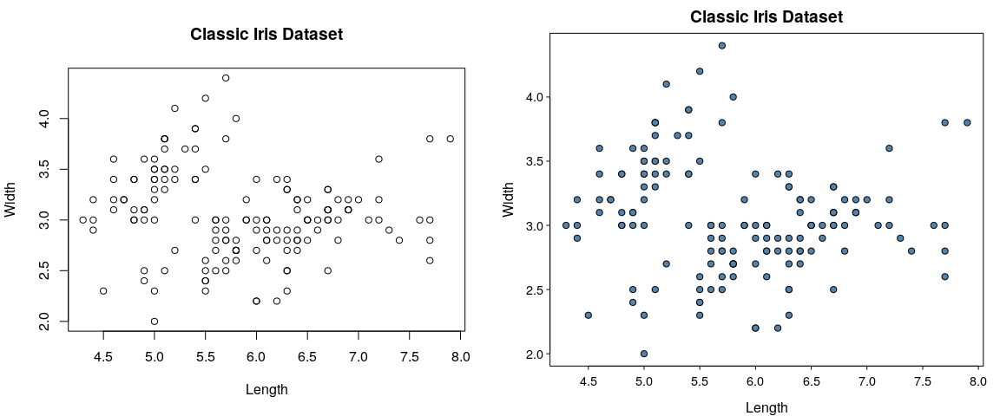

<!-- README.md is generated from README.Rmd. Please edit that file -->

## Prettified Base Graphics

[](https://travis-ci.org/jumpingrivers/prettyB)
[](https://codecov.io/github/jumpingrivers/prettyB?branch=master)

Anyone who uses R Base graphics, have a 100 and 1 tweaks that they use
to make the figures more presentable. This package aims to capture the
tweaks in one place. By *masking* standard plotting functions, we can
automatically make base graphics a bit more pretty.

## Installation

The package is still being developed and the API is subject to change.
To install the package from github, use **devtools**

``` r
devtools::install_github("jumpingrivers/prettyB")
```

The package can then be loaded in the usual way

``` r
library("prettyB")
```

## Usage

All plotting functions work exactly as before, with the same inputs. The
difference is that the defaults have been changed. For example, compare

``` r
op = par(mfrow = c(1, 2))
graphics::plot.default(iris$Sepal.Length, iris$Sepal.Width)
plot(iris$Sepal.Length, iris$Sepal.Width)
```


The second `plot()` function call is from the **prettyB** package.

There are currently two themes: `expand` and `minimal`(default):

``` r
theme_set("expand")
par(mfrow = c(1, 2))
graphics::plot.default(iris$Sepal.Length, iris$Sepal.Width, 
     main="Classic Iris Dataset", xlab="Length", ylab="Width")
plot(iris$Sepal.Length, iris$Sepal.Width, 
     main="Classic Iris Dataset", xlab="Length", ylab="Width")
```



<!-- ## Other plots -->

<!-- The package also prettifies other functions, currently only qqplots. -->

<!--   * qqplots -->

<!--     ```{r, qqplots,echo=-1} -->

<!--     theme_set("minimal") -->

<!--     par(mfrow = c(1, 2)) -->

<!--     x = rnorm(20) -->

<!--     stats:::qqnorm.default(x) -->

<!--     qqnorm(x) -->

<!--     ``` -->

<!-- * Histograms --> <!--   ```{r, echo=-1} -->
<!--   par(mfrow=c(1, 2)) --> <!--   z = rt(100, 2) -->
<!--   graphics::hist.default(z, main="The t-distribution") -->
<!--   hist(z, main="The t-distribution") --> <!--   ``` -->
<!-- * barplots --> <!--   ```{r, echo=-1} -->
<!--   par(mfrow = c(1, 2), cex=0.9) -->
<!--   graphics::barplot.default(VADeaths, main = "Death Rates in Virginia") -->
<!--   barplot(VADeaths, main = "Death Rates in Virginia") -->
<!--   ``` -->

## Package Rationale

This package is **not** a replacement for **ggplot2** or other R related
plotting packages. Instead, it has a few simple aims

  - provide package authors a low dependency method of making their
    plots look pretty
  - provide academics with a way of generating nice plots, but not worry
    about future changes in R
  - provide a simple way for improving the look and feel of plots in
    teaching

Since the generated plots by **prettyB** use standard base graphics,
with no new arguments, this makes plots future proof. As a fall-back,
just don’t load the package.

## Other information

  - If you have any suggestions or find bugs, please use the github
    [issue tracker](https://github.com/jumpingrivers/prettyB/issues)
  - Feel free to submit pull requests

### TODO

  - Box plots, barplots, histograms
  - Think a bit more about palettes
  - Vignettes: What defaults have been changed.

-----

Development of this package was supported by [Jumping
Rivers](https://www.jumpingrivers.com)
